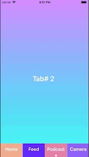

# D3ScrollableTabBar
A scrollable Tab Bar. Can be used as bottom or top level bar. Add any number of Tabs.

# USAGE
# 1) Create Items:

    lazy var Item: BottomBarItem = {
    
           let item = BottomBarItem(title: "Camera")
        
           item.backgroundColor = #colorLiteral(red: 0.5568627715, green: 0.3529411852, blue: 0.9686274529, alpha: 1)
           
        return item
      demo.gif  
    }()
    
# 2) Setup Bar and Add Items

    let bottomView = BottomBar(frame: .zero, defaultVisibleItem: 2)
    bottomView.addBottomBarItem(barItem: cameraBottomBarItem)
    
   
# 3) Conform to BottomBarDelegate(OPTIONAL)
      
      bottomView.delegate = self
 
# 4)Implement Delegate Function:

    func didSelect(barItem item: BottomBarItem) {
	 self.label.text = "Tab# \(item.tag)"
     }
# Item can be identified using item.tag.Tag is assigned by the order of item added.
# Thats it.
 
 # TODO:
 ADD Animation while switching tabs.
